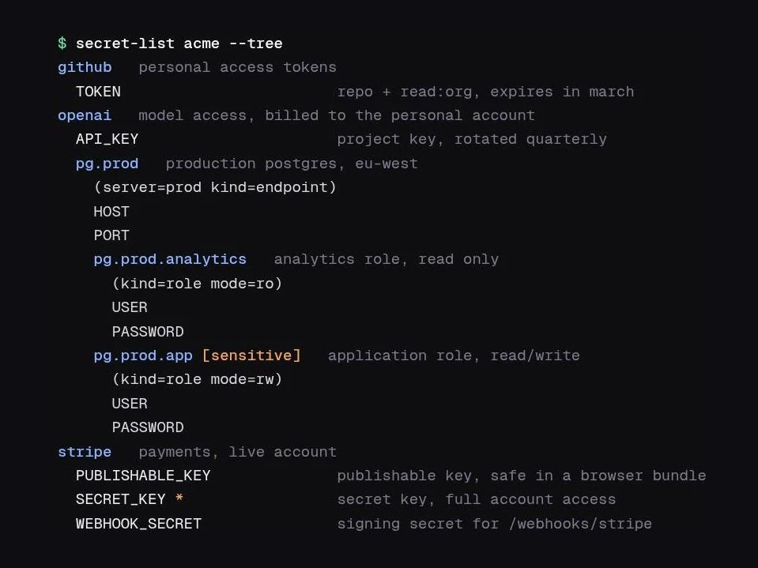
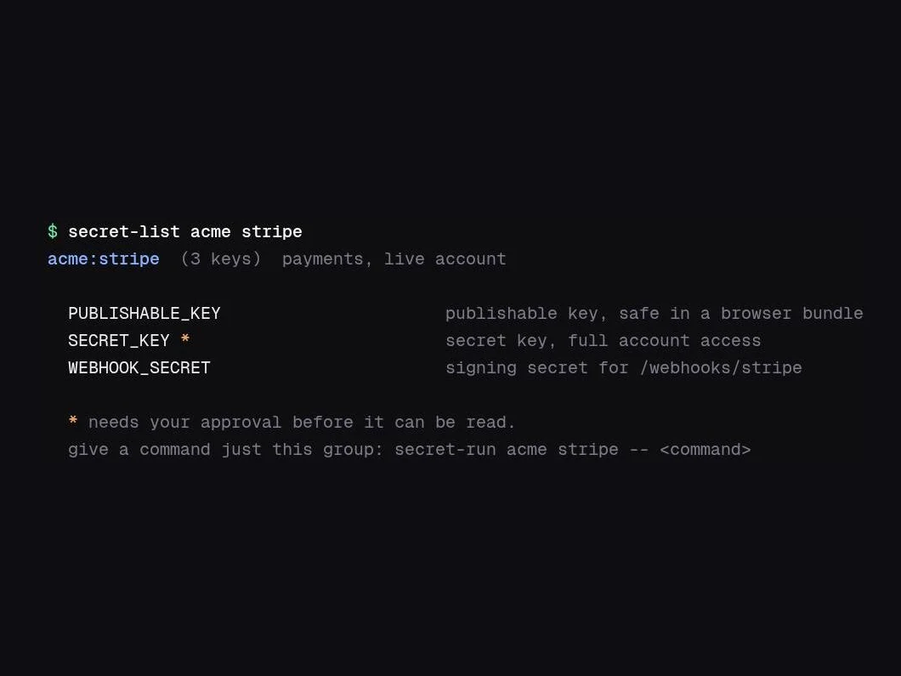
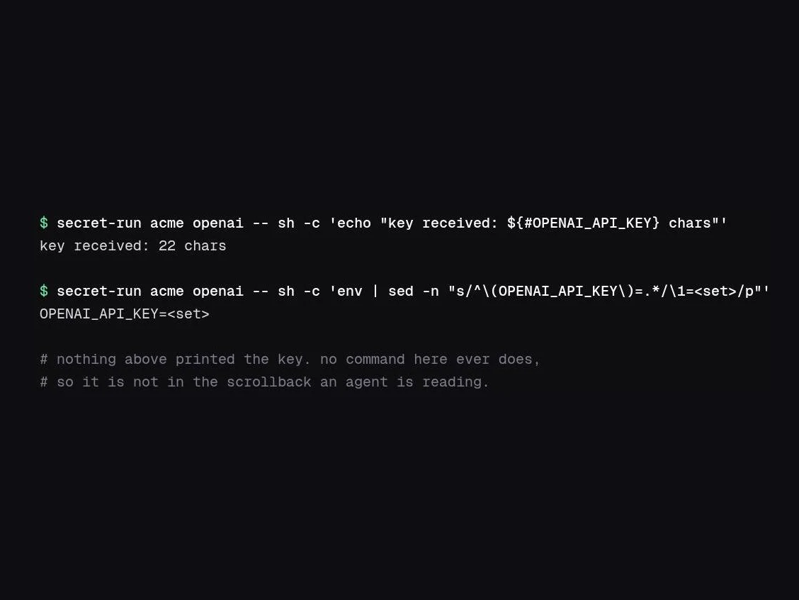
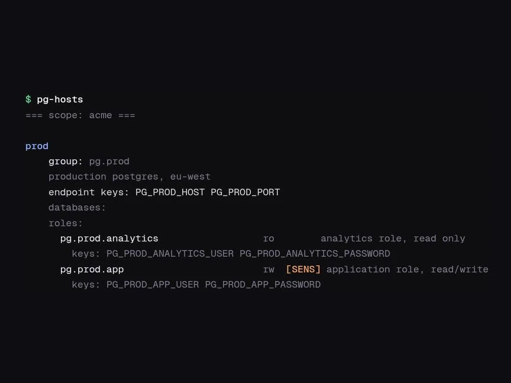

# agent-secrets

a small bash tool for encrypted .env scopes, meant for working next to coding agents.

each scope is one gpg-encrypted file with a separate key. commands read group and key names without decrypting anything. a root-owned helper can ask for a local desktop approval before a group you marked sensitive reaches an editor or a child process.

## what this is, and what it is not

this tool shapes how an agent reaches a secret. it does not stop one that decides to take it.

read that again before you rely on it, because the difference is the whole point.

**what it does.** secrets sit encrypted instead of in plaintext .env files an agent trips over while grepping the repo. values go into the environment of a child process, and no command here prints one to stdout, so a secret does not land in your transcript just because an agent needed it. an agent can browse group names, key names and descriptions without decrypting anything, so it can work out what exists without touching a value. a command receives the groups it names rather than the whole store. groups you mark sensitive open a prompt naming what was asked for and why, and every verdict goes to the system journal.

**what it does not do.** it does not stop an agent that wants the value. the agent can run `secret-run <scope> <group> -- curl ...` against any group you did not mark sensitive, and nothing prompts you. it does not stop an agent from rewriting the commands, either. `~/.local/bin/secret-run` belongs to your account, and while the root-owned helper cannot be replaced, the thing that calls it can. before the root install it protects nothing at all, since your account can read the key file and so can anything running as you. and it does not help once you approve a prompt. an approval lasts fifteen minutes by default and the group stays readable for all of it.

what you get is hygiene and visibility rather than containment. the careless path becomes safe and the deliberate path becomes noisy. an agent acting in bad faith with your privileges still wins, and no amount of work on this tool changes that. if you need an agent to be unable to reach a credential, do not give it to a process running as you. run the agent as another user, or keep the credential on another machine.

this is for one person on one machine. it is not a shared secret manager, and it does not replace backups or reading the command you are about to hand a secret to.

## why it is encrypted at all

not to stop a local process. a local process asks the helper and gets what it asks for.

the encryption is for the copies that leave this machine. each scope is one self-contained gpg file, so `scopes/` can go to google drive, dropbox, a private git repo, an rclone remote or a usb stick without its contents going too. the key sits in its own directory for exactly this reason: you sync `scopes/` and leave `key/` behind. `secrets-bisync` does that, and nothing here ever puts `key/` in a sync target.

back the key up separately, by hand, once. a scope without it cannot be recovered, and that is the intended property rather than a gap.

one caveat worth knowing before you point this at a cloud drive. `index/` is plaintext. it holds no values, but it does hold group names, key names and the descriptions you wrote, so syncing it publishes an inventory of which credentials you have and what they are for. set `AGENT_SECRETS_SYNC_INDEX=0` to sync only the ciphertext. `secret-reindex` rebuilds the index on the other machine.

## start here

new to this? [the user guide](docs/guide.md) is a ten minute walkthrough: make
a scope, put a secret in it, find it again a week later, and hand it to a
command without it appearing on your screen.

## install

clone the repository, then run:

~~~bash
./install.sh
~~~

the installer puts commands in ~/.local/bin and its helper in ~/.local/libexec. it also creates ~/.secrets and a new key if one does not exist.

make sure ~/.local/bin is on your path:

~~~bash
export PATH="$HOME/.local/bin:$PATH"     # bash, zsh, in ~/.bashrc or ~/.zshrc
~~~

~~~fish
fish_add_path ~/.local/bin               # fish, once, and it persists
~~~

create a first scope with your normal editor:

~~~bash
secret-edit example --new
~~~

add plain .env entries, save, then browse the scope without decrypting anything:

~~~bash
secret-list example
~~~

to put the key out of reach of your own account, so that reading a sensitive group needs an approval rather than a file read, run:

~~~bash
sudo ~/.local/libexec/agent-secrets-install-root
secret-helper-status
~~~

the root step is optional for a first trial, but it is the setup worth keeping. [the setup guide](docs/setup.md) has the full sequence.

## browsing

`secret-list` works like `ls`. with no arguments it lists scopes; with a scope
it shows that scope's top level; with a group it shows one level inside that
group. nothing here decrypts a value.

~~~text
$ secret-list work
work  (7 groups, 14 keys)

  pg/             3 groups, 8 keys  postgres endpoints and roles
  service/        1 group, 3 keys   third-party apis
  ssh/            2 keys            host aliases

  EDITOR_TOKEN                      personal editor token

  go deeper with: secret-list work pg

$ secret-list work pg.aws
work:pg.aws  (1 group, 4 keys)  rds instances in eu-west-1

  app/          2 keys            application role, read-write  [sensitive]

  HOST
  PORT
~~~

the count on each subgroup is what is underneath it, so you can tell whether a
branch is worth opening before you open it.

inside a group, a `*` marks a key that needs an approval before anything reads
it, and the last line names the command that hands that one group to a program.

`--tree` still prints the whole subtree when you want it, and now takes a group
so you can scope it: `secret-list work pg --tree`. `--keys` prints every
variable name, one per line, for scripts.

## commands

~~~text
secret-init
secret-list [scope] [group] [--tree | --keys]
secret-edit scope [group | --new]
secret-set scope group.path.key [--desc text] [--force]
secret-ask scope group.path.key [--desc text] [group.path.key [--desc text]]... [--force]
secret-approve scope --motive "short reason" group [group...]
secret-run scope (group [group...] | --all-groups) [--motive "short reason"] -- command [args...]
secret-reindex [scope...]
secret-doctor
secret-update [--check]
secret-rekey [--resume | --finish]
pg-hosts [server | --scope scope]
ssh-hosts [alias]
secrets-bisync
secret-helper-status
~~~

use secret-run to give a command only the group it needs:

~~~bash
secret-run example service.api -- curl -fsS https://api.example.test/me
~~~

name several groups when the job needs several. the gate is the union of what
those groups carry, so it is still one dialog and still not the whole scope:

~~~bash
secret-run example service.api service.access -- curl -fsS https://api.example.test/me
~~~

the child process gets the value. the terminal does not, so the key is not in
the scrollback an agent reads afterwards.

never use it with env, printenv, set, or another command whose job is to print the environment.

`pg-hosts` reads the same index and prints what a scope knows about postgres:
servers, the roles under each one, and the variable names a role sets. enough
to write the connection without opening the scope. `ssh-hosts` does the same
for host aliases.

## store layout

~~~text
~/.secrets/
  scopes/       encrypted .env payloads
  index/        key names, groups, descriptions, and sensitivity marks
  key/.key      the 32-byte gpg key
~~~

the index contains no values. it is safe to read, but it can go stale after an out-of-band scope change. run secret-reindex after restoring or replacing a .env.gpg file.

back up scopes/ and key/.key separately. do not put key/ in a broad sync folder or this repository.

## skill

[skills/secrets/SKILL.md](skills/secrets/SKILL.md) is a portable skill file for coding agents. copy it into the agent's skill directory after installing the commands. it tells an agent how to discover metadata, narrow a group, and avoid printing values.

## updating

~~~bash
secret-update --check
secret-update
~~~

an upgrade replaces code and never reads, rewrites or deletes a stored secret.
that is checked in ci: `tests/upgrade.sh` fingerprints every byte of a store,
reinstalls over the top, and fails if anything moved.

if you run the hardened setup, the root-owned helper is installed separately
and `secret-update` will remind you to rerun the root installer.
[updating.md](docs/updating.md) covers the version numbers, migrations, and
what the backup does and does not include.

## platforms

linux and macos are supported. windows is supported through wsl2 and not
natively, because the protection here is posix file ownership plus sudo plus a
root-owned helper, and a git-bash install would report success while protecting
nothing.

run `secret-doctor` to see exactly what your machine can do and what it is
missing. [compatibility.md](docs/compatibility.md) has the full matrix,
including the one caveat that keeps hardened mode off most macs.

## notes

- the approval dialog only works from an active, unlocked local desktop session.
- rclone is optional and only used by secrets-bisync.
- the tool does not store values in this repository.

[security.md](docs/security.md) goes through the limits again in more detail. read it before you decide how much to trust this with.
